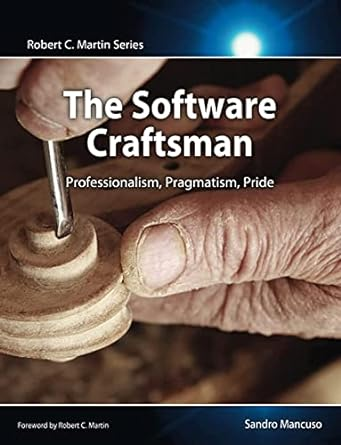

# Ces livres qui m'ont marqué

### Software Craft

  

### Clean Craftsmanship

  

### Clean Code

  

### The Software Craftsman - Professionalism, Pragmatism, Pride

  

### Domain Driven Design - Tackling Complexity in the Heart of Software

  

### Domain Driven Design Distilled

  

### Domain Modeling Made Functional

  

### Clean Architecture

  

### Clean Agile

  

### Clean Coder

  

